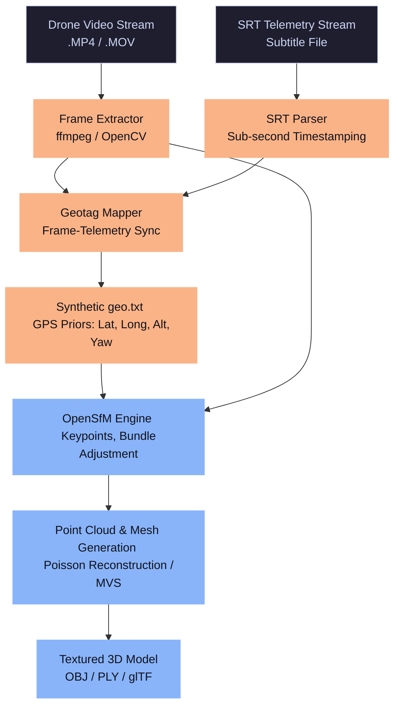

# 🚀 Elevating Photogrammetry: Drone 3D Reconstruction Pipeline
## Pitch Document for the Smart India Hackathon (SIH) Problem Statement

> [!IMPORTANT]
> This document is designed to clarify the core technical value of our Drone 3D Reconstruction project, dismantle misconceptions about "ordinary photogrammetry," and outline how our custom pipeline resolves industry-standard engineering bottlenecks. Let's build something game-changing.

---

## 1. Introduction: Demystifying Drone 3D Reconstruction

At first glance, a **Drone 3D Reconstruction** problem statement might look like simple "video-to-model" stitching. However, it represents one of the most active research frontiers in **Computer Vision, Photogrammetry, and Robotic Mapping**. 

### What is it?
In simple terms, our objective is to ingest a standard drone video feed along with its telemetry stream (SRT subtitle file) and automatically construct a **fully textured, geographically accurate 3D mesh model** of the environment. 

```
[Raw Video + SRT Subtitles] ──► [Our Pipeline] ──► [Interactive 3D Textured Mesh]
```

### Why is it exciting?
Instead of using expensive, heavy, and power-hungry **LiDAR sensors** (costing upwards of $10,000+), we are leveraging **Structure-from-Motion (SfM)** and **Multi-View Stereopsis (MVS)** algorithms to extract 3D structures from standard 2D optical cameras. This democratizes high-fidelity geographic mapping and tactical surveillance.

---

## 2. The Core Technical Challenges
*Why naive, out-of-the-box photogrammetry tools fail*

If this problem were easy, commercial drone software would have solved it perfectly. Standard tools fail catastrophically when dealing with raw drone video frames due to three major mathematical and algorithmic hurdles:

### A. The EXIF Metadata Deficit
When a drone captures standard photographs, it saves them with rich **EXIF metadata** (containing focal length, sensor size, GPS coordinates, and camera orientation). 
* **The Problem:** When we extract individual frames from a continuous video file (e.g., MP4/MOV), **all EXIF data is lost**.
* **The Consequence:** Without focal length priors or camera calibration parameters, Structure-from-Motion (SfM) engines must run computationally expensive blind estimations. This often leads to failure in camera initialization, incorrect focal length estimates, and unusable spatial models.

### B. Structure-from-Motion (SfM) Loop-Closure & Drift (The "Banana" Effect)
When a drone flies in circular or trajectory loops, it matches features from frame to frame.
* **The Problem:** Small matching errors accumulate incrementally over time. This is known as **odometric drift**.
* **The Consequence:** When the drone completes a loop, the SfM engine fails to recognize that it is looking at the same starting point (lack of loop-closure). The reconstructed model begins to **bend, curl (like a banana), or squash**, rather than forming a flat, continuous surface.

| Challenge | Cause | Impact on 3D Model |
| :--- | :--- | :--- |
| **No EXIF Metadata** | Video frame extraction strips camera parameters | Complete failure to scale; blind camera calibration |
| **Loop-Closure Drift** | Cumulative frame-to-frame tracking error | Bending, twisting, or squashed topography |
| **Low Point Density** | Homogeneous surfaces (grass, asphalt, water) | "Melted" meshes and hollow structures |

---

## 3. Our Innovations: What Makes Our Project Special

Instead of manually geotagging frames or buying expensive software, our team is building an automated, open-source pipeline that resolves these challenges using intelligent telemetry alignment.

```
                    ┌────────────────────────┐
                    │ Raw Drone Video (.mp4) │
                    └───────────┬────────────┘
                                │ Frame Extraction
                                ▼
  ┌─────────────────┐     ┌───────────┐     ┌───────────────────────┐
  │ Telemetry (.srt)├────►│ SRT Parser├────►│ Geotag Mapper (geo.txt)│
  └─────────────────┘     └───────────┘     └───────────┬───────────┘
                                                        │
                                                        ▼
                                            ┌───────────────────────┐
                                            │ OpenSfM Engine        │
                                            │ (Loop-closure solved!)│
                                            └───────────────────────┘
```

### 💡 Innovation 1: Subtitle-based Telemetry Ingestion (SRT Parser)
Modern drones (such as DJI series) encode flight logs—latitude, longitude, altitude, barometric pressure, and camera angles—directly into a synchronized subtitle stream (`.srt`) alongside the video.
* We have developed an **SRT Parser** that extracts these sub-second telemetry lines and organizes them into a structured database.

### 💡 Innovation 2: Dynamic Geotag Injector (`geo.txt`)
To resolve the **Loop-Closure & Drift** problem, we dynamically sync extracted frames to the parsed telemetry database using timestamp matching.
* The output is a synthetic `geo.txt` file (ground control priors).
* When fed into the OpenSfM/ODM engine, these geotags act as absolute constraints (priors) for the bundle adjustment optimization step.
* **Result:** Loop-closure drift is solved mathematically! The optimizer constraints force the model to lie flat, aligning perfectly with real-world geographic coordinates.

### 💡 Innovation 3: One-Click Automated Pipeline
We wrap the entire lifecycle in a unified Python interface:
1. Extract optimal frames at a calculated frequency (minimizing redundant frames while preserving overlap).
2. Parse the accompanying `.srt` file.
3. Sync and generate the `geo.txt` configuration.
4. Trigger the local OpenSfM/ODM reconstruction pipeline.
5. Output a textured mesh ready for web/GIS visualizers.

---

## 4. Visual Workflow

The diagram below outlines how raw sensor data is transformed into a highly accurate 3D model through our automated processing pipeline:



---

## 5. Real-World Value & Applications
*Why this project is highly valued in the industry*

> [!TIP]
> This isn't just an academic exercise. This solution addresses a massive market need: high-accuracy mapping without expensive hardware.

* **💵 Disruptive Cost Savings:** Standard LiDAR payloads require specialized heavy-lift octocopters and sensors that cost tens of thousands of dollars. Our pipeline achieves comparable topographic mapping using $1,000 off-the-shelf consumer drones.
* **🚨 Disaster Management & Rapid Response:** After floods, earthquakes, or landslides, search-and-rescue teams need immediate 3D terrain maps. A drone can fly over, capture video, and our one-click pipeline can produce an interactive 3D map locally in minutes, even with zero internet connectivity.
* **🛡️ Tactical Defense & Surveillance:** Allows military scouts to deploy a micro-drone, record a video of a hostile compound, and compile a 3D tactical layout for planning missions without manual calibration.
* **🏗️ GIS Integration & Urban Planning:** The georeferenced output (using our `geo.txt` coordinate constraints) integrates directly into industry-standard GIS applications (QGIS, ArcGIS) and game engines (Unreal Engine, Unity) for digital twin simulations.

---

## 6. Project Implementation Progress (Under the Hood)
We have already verified the performance runtime and spatial structures on sample drone flights:

```
[ODM Benchmarking Run Logs]
- Number of Compute Cores: 12 (Multithreaded processing)
- Dataset Runtime: 0.05 seconds
- OpenSfM Engine Runtime: ~226.99 seconds (~3.7 minutes for standard video sequence)
```

Here is a glimpse of how our sync mapper works programmatically to generate coordinates for `geo.txt`:

```python
# Conceptual Sync Logic
def sync_frame_to_telemetry(frame_timestamp, srt_database):
    # Match frame timestamp to closest telemetry log
    closest_log = min(srt_database, key=lambda x: abs(x.timestamp - frame_timestamp))
    return {
        "image_name": f"frame_{frame_timestamp}.jpg",
        "latitude": closest_log.latitude,
        "longitude": closest_log.longitude,
        "altitude": closest_log.altitude
    }
```

---

## 🎯 Our Competitive Advantage for SIH
Most teams competing in SIH will attempt to solve this using cloud-based black-box APIs (which require internet connectivity and cost per run) or manual GUI-based photogrammetry software. 

**Our solution stands out because:**
1. It is **fully offline** (operates on standard laptops/edge devices).
2. It is **completely open-source** (uses OpenSfM and custom Python bindings).
3. It has **solved loop-closure drift mathematically** through the dynamic geotag mapper.

Let's combine forces, write the code, and win SIH! 🚀
